Before we start, take a look at the sample output at the end of this tutorial. To see the live demo, click on this link
https://lumen.netlify.app/

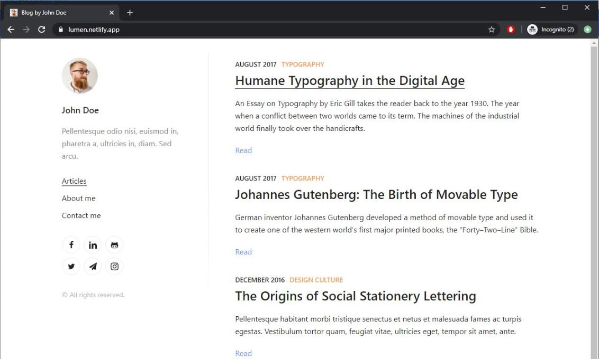

</br>

</br>

</br>

<h1><font size="5", color="#2E86C1">Step 1: Install Node.js</font></h1>

</br>

Head over to https://nodejs.org/en/ and download the latest stable build.

</br>

After installation, open cmd and check the node version with following command.

```console
> node --version
> v14.2.0
```

</br>

<h1><font size="5", color="#2E86C1">Step 2: Install Python</font></h1>

</br>

Don't worry, there won't be any python coding here. 
You only need it to build.

Download the installer here https://www.python.org/downloads/x

Once installed, check the version by running the following command.

```console
> python --version
> Python 3.8.2
```

Make sure to add Python in your Environment Variables

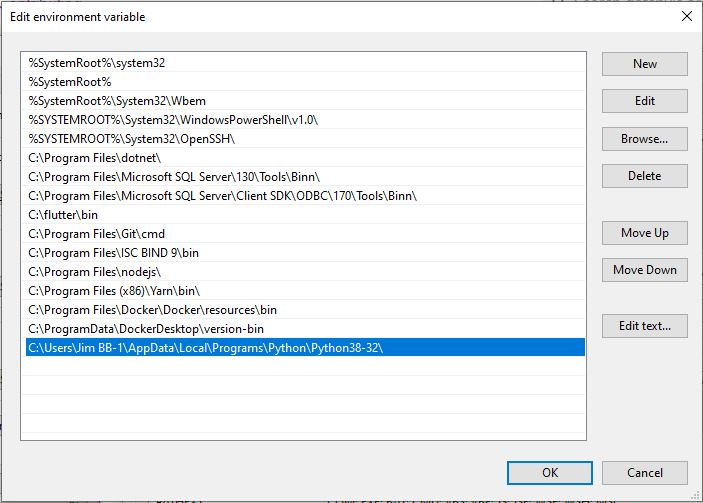 

</br>
</br>

<h1><font size="5", color="#2E86C1">Step 3: Install Git</font></h1>

</br>

Download the latest installer in https://gitforwindows.org/

Once installed, check the version by running the following command.

```console
> git --version
> git version 2.26.2.windows.1
```

</br>

<h1><font size="5", color="#2E86C1">Step 4: Install Github Desktop</font></h1>

</br>

Download Github Desktop installer in https://desktop.github.com/

Note that is optional. If you are more comfortable doing git related stuff in command line, you can skip this.
If you prefer GUI, then go ahead and install it.

</br>
</br>

<h1><font size="5", color="#2E86C1">Step 5: Create Github repository</font></h1>

</br>

Assuming that you already have a Github account, create a new repository.

In this example, let's name it **mywebsite**

</br>

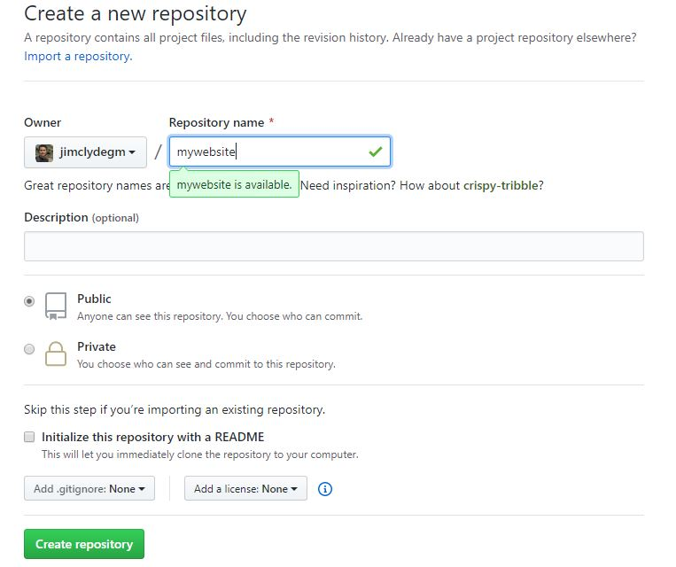 

</br>

Click on **Create repository**  button to create the repo.
This is where all the source code of our website will reside.

Now that our repository is setup, we can forget about it and go over building our website.

</br>
</br>

<h1><font size="5", color="#2E86C1">Step 6: Choose your website template</font></h1>

</br>


Here's the fun part, select the best template that suits your needs from gatsby site https://www.gatsbyjs.org/starters/?v=2

Below is a screenshot for a sample list of the available templates

</br> 

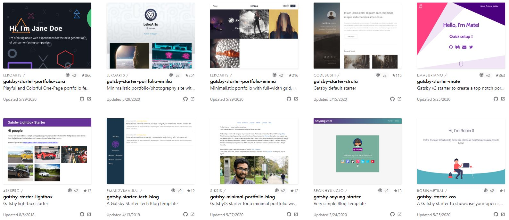

</br>

In this tutorial, let's select a Portfolio Template **gatsby-starter-lumen**

Checkout the details in https://www.gatsbyjs.org/starters/alxshelepenok/gatsby-starter-lumen/

Github code in https://github.com/alxshelepenok/gatsby-starter-lumen

</br>

</br>

<h1><font size="5", color="#2E86C1">Step 7: Create the website</font></h1>

</br>

Open up Git Bash and navigate to your desired local directory.

Execute the command to clone the starter website from Git repo to your local disk.

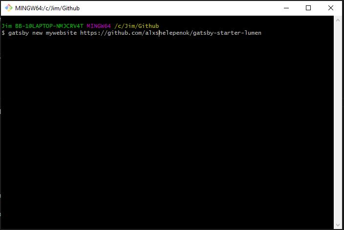

Important: Make sure to rename 'mywebsite' with your desired website name.

Check the files in your local folder and take note of the file/folder structure, it should look like this.

</br>

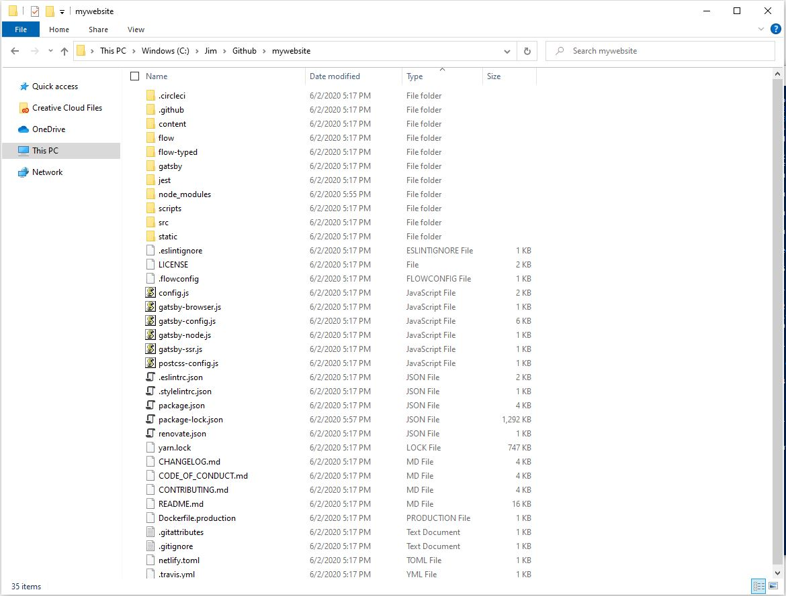


In case you run into errors, just like I did with Python version issue.

gyp verb check python checking for Python executable python2 in the PATH
gyp verb which failed Error: not found: python2

Follow these steps:

    1. Delete node_modules folder
    2. Run "npm install --global windows-build-tools"
    3. Reinstall the node modules with "npm install"

</br>

<h1><font size="5", color="#2E86C1">Step 8: Test in localhost</font></h1>

</br>

Before we publish our website, it is better to test it in our localhost first.

Open up the terminal and run the following command.

```console
> gatsby develop
```

You should get a message to run the site in localhost, like this

</br>

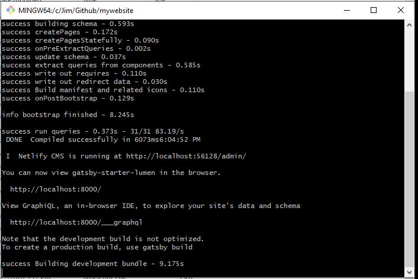

</br>

Check it and see if site is rendered in browser

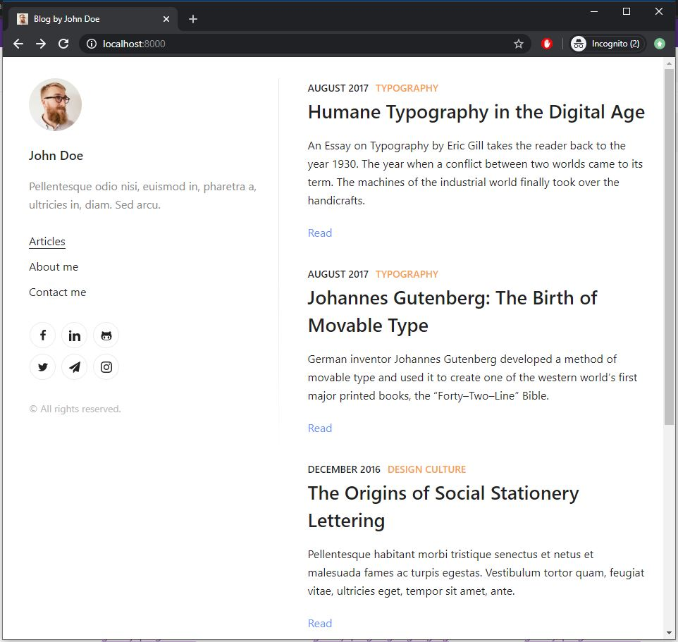

</br>

</br>

<h1><font size="5", color="#2E86C1">Step 9: Push to Github</font></h1>

</br>

Netlify will get the source code from Git repository. So first, we need to put our codes in our Git repo.

Open up the terminal and execute the command below

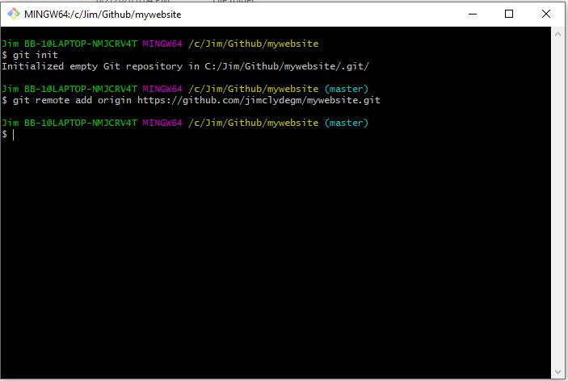

</br>

Now open up Github Desktop and go over to our website repo.

I repeat you can do the next steps in command line, but I prefer using the GUI. It really depends whichever method you are comfortable with.

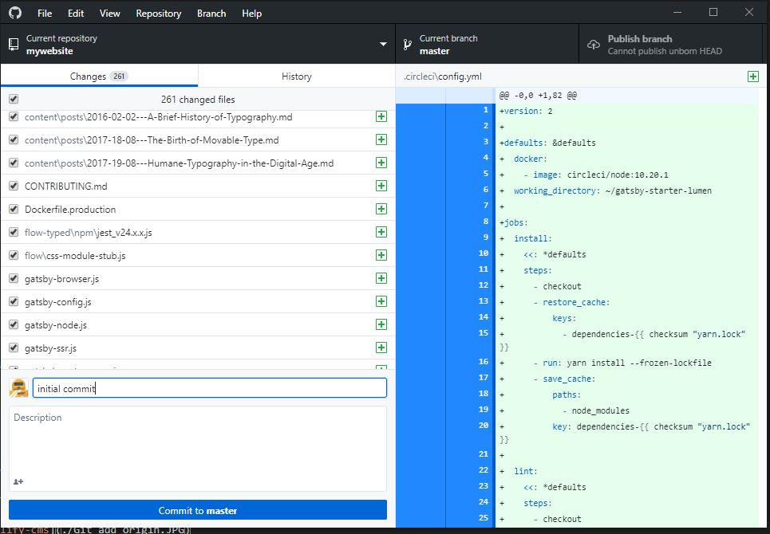

</br>

Then click on Publish Branch. This will push all staged files to Github repo.

</br>

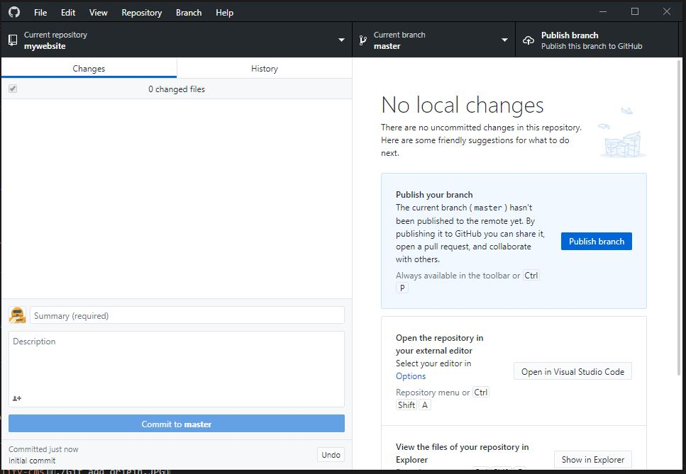

</br>

Finally check the repo if all our files are pushed successfully.

</br>

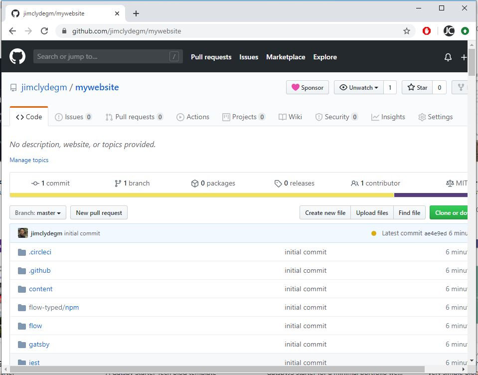

</br>

It's there. Awesome! Now we're ready to publish our website!

</br>

</br>

<h1><font size="5", color="#2E86C1">Step 10: Publish to Netlify</font></h1>

</br>

In our repository page, scroll down and see the Deploy with Netlify section.

Click the "Deploy with Netlify" button.
This will redirect to Netlify website.
Follow as instructed

</br>

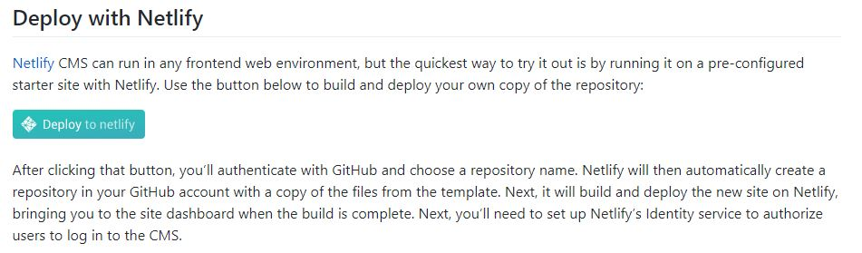

</br>

Finally deploy the website!

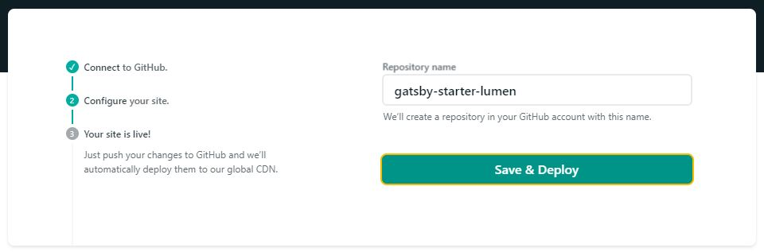

</br>

Netlify will automatically build and deploy the site.

Let's checkout the final website we created in this tutorial https://compassionate-liskov-3ff04c.netlify.app/

</br>

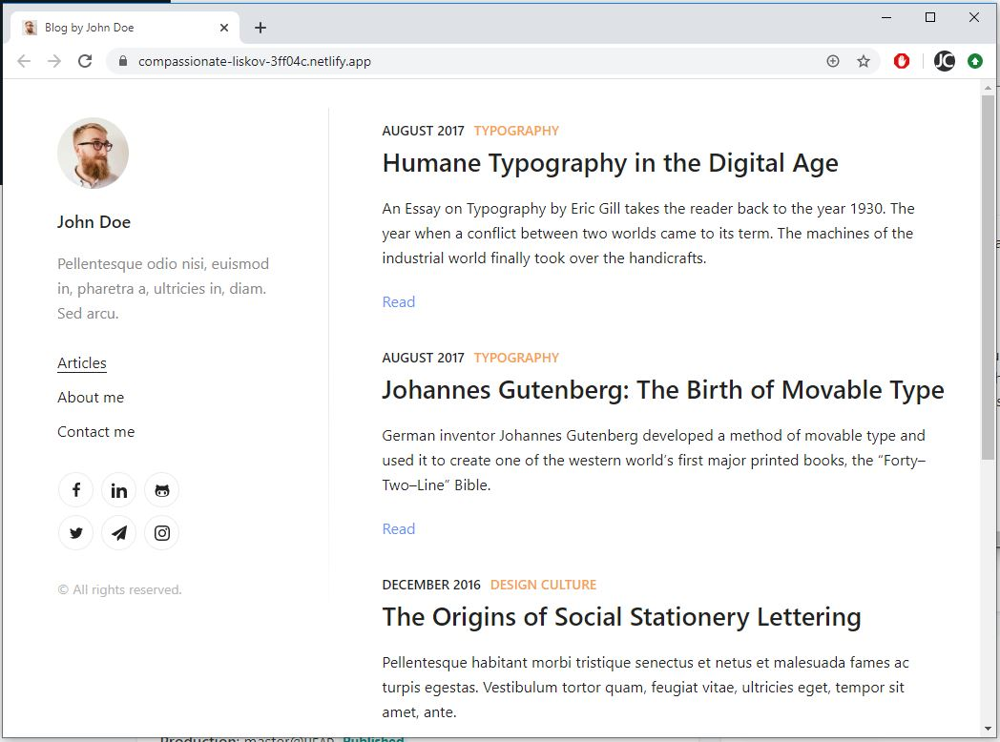

</br>

If you think this tutorial is helpful, please share it.
Any comments or suggestions, feel free to write them in disqus section. Thanks!