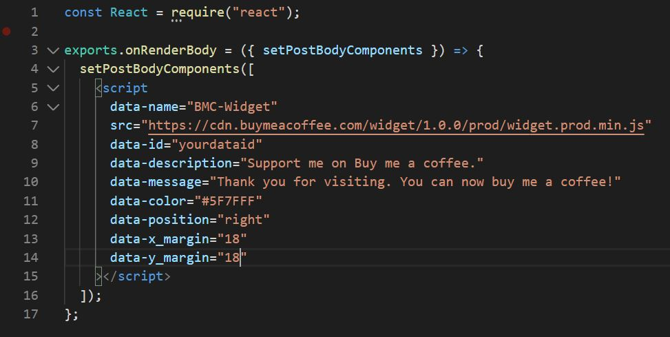

This tutorial will guide you on how to add a mini widget Buy me a coffee into your Gatsby website.


</br>

</br>

</br>

<h1><font size="5", color="#2E86C1">Step 1: Create a Buy me a cofee account</font></h1>

</br>

Head over to https://www.buymeacoffee.com/home and crete your account.

</br>

<h1><font size="5", color="#2E86C1">Step 2: Create widget</font></h1>

</br>

Under Dashboard head over to Your Button & Widget and click on **Widget Generator**


 

</br>
</br>

<h1><font size="5", color="#2E86C1">Step 3: Generate Widget Code</font></h1>

</br>

Feel free to customize the look and feel of your widget.

Then click on **Copy Widget Code**

 

</br>

</br>

<h1><font size="5", color="#2E86C1">Step 4: Add widget to your website</font></h1>

</br>

Your widget code should look something like this

</br>

```console
<script data-name="BMC-Widget" 
src="https://cdnjs.buymeacoffee.com/
1.0.0/widget.prod.min.js" 
data-id="yourdataid" data-description=
"Support me on Buy me a coffee!" 
data-message="Thank you for visiting. 
You can now buy me a coffee!" data-color=
"#FF813F" data-position="right" 
data-x_margin="18" data-y_margin="18"></script>
```

</br>

Edit **gatsby-ssr.js** file and your code should look like this.
Take note that the attributes should be similar to the copied codes above.

</br>

 

</br>

<h1><font size="5", color="#2E86C1">Step 5: Test the widget</font></h1>

</br>

It's pretty much done. All you need to do now is to test if it works.

</br>

 

</br>