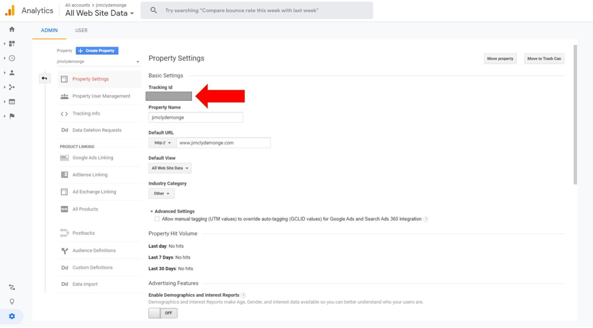
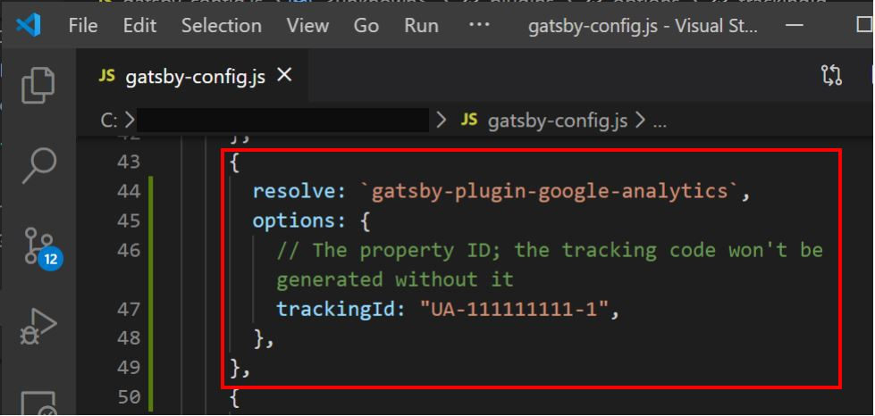

This tutorial will guide you on how to add Google Analytics into your Gatsby website.

 

 

<h1>Step 1: Setup Google Analytics</h1>

 

Visit https://analytics.google.com/ and setup your account

 

 

 

<h1>Step 2: Get your Tracking ID</h1>

 

After you setup Google Analytics, go to Admin > Account Settings > Property Settings

 

 

Get your Tracking ID. It looks something like this **UA-111111111-1**

 

 

<h1>Step 3: Configure Gatsby </h1>

 

Open up gatsby-config.js file and add the code block below.

Make sure that the Tracking ID is same as your Tracking ID in Step#2.

 

 

 

That's basically it, go ahead and deploy your site to test. Page visits should automatically be picked up in your Google Analytics Dashboard.