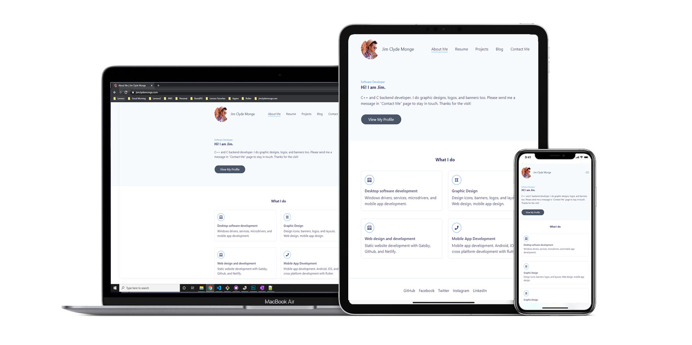
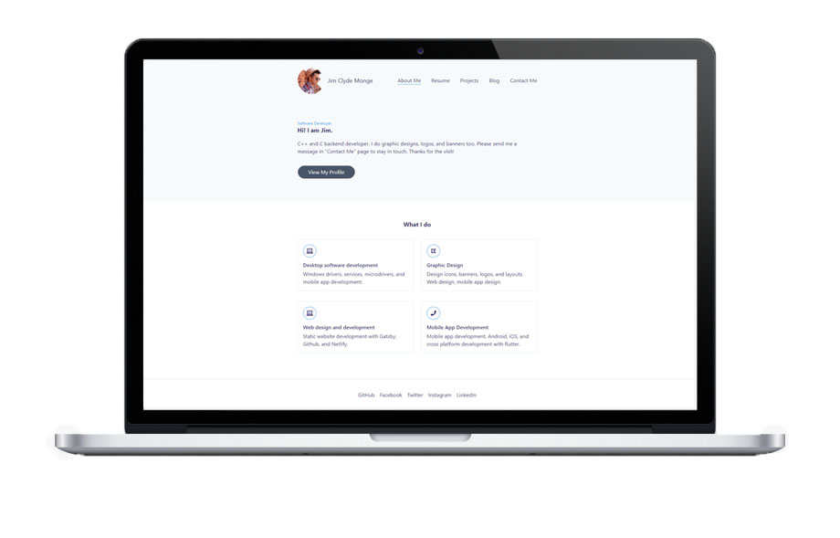
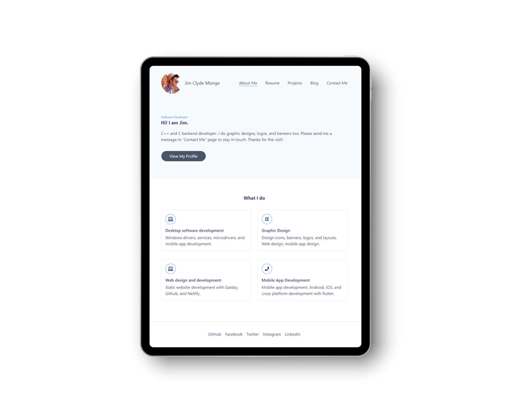
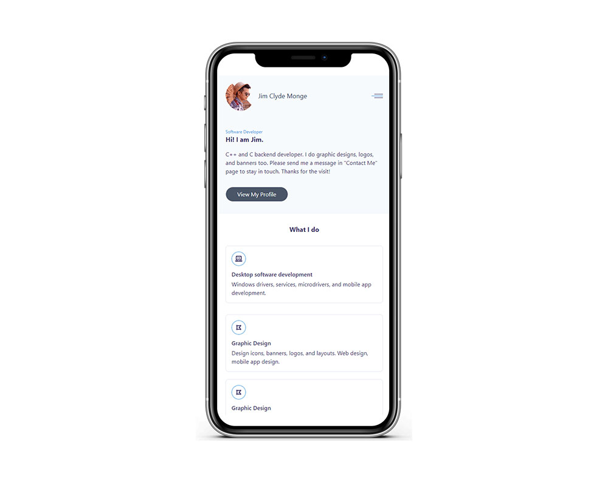

**Description**

This is a static portfolio website I created with minimal coding involved. Here I showcase some of my few side projects and also put up some mini tutorials while learning new technologies.

This is a fully responsive site with custom domain name and SSL certificate.

 

**Technologies used**

 

- [ ] Github
- [ ] Gatsby
- [ ] Netlify

 

**Sample screenshots**

 

 

 

